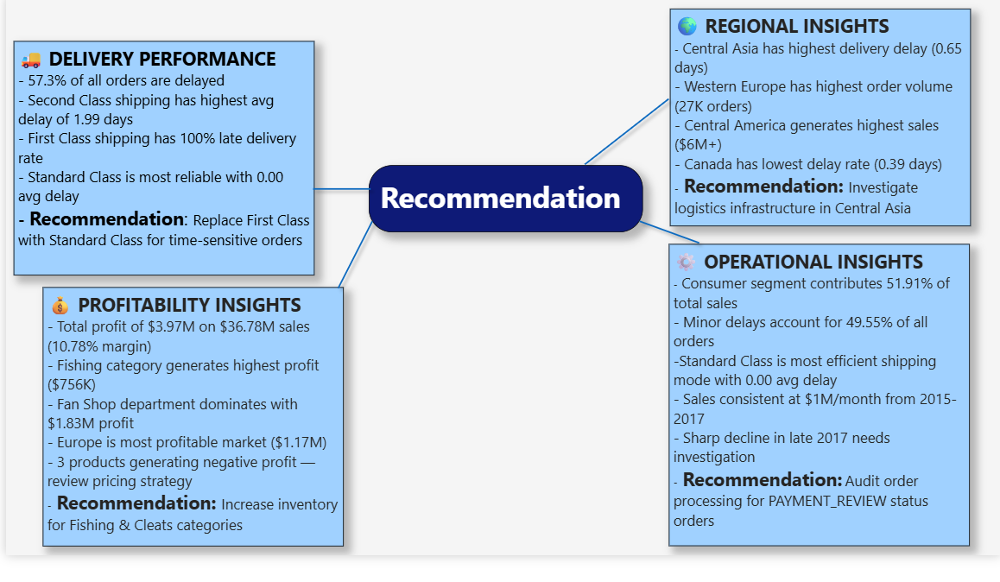

# 🏭 Supply Chain Analytics & Performance Optimization

## 📌 Project Overview
An end-to-end supply chain analytics solution built on 180,519 records 
across 5 global markets (2015–2018). This project covers the full 
analytics pipeline from raw data ingestion to executive dashboard.

---

## 🧠 Business Problem
A retail supply chain company wants to:
- Reduce shipping delays affecting 57.3% of all orders
- Improve operational efficiency across global markets
- Analyze profitability across products and regions
- Optimize shipping mode strategy

---

## 🛠️ Tech Stack
| Tool | Purpose |
|---|---|
| Python (Pandas, NumPy) | ETL Pipeline & EDA |
| PostgreSQL | Data Warehouse & SQL Analysis |
| Excel | Business Reporting & Pivot Tables |
| Power BI | Executive Dashboard |
| GitHub | Portfolio Presentation |

---

## 🔄 ETL Pipeline
- Loaded 180,519 raw supply chain records
- Cleaned nulls, duplicates and standardized text fields
- Converted date columns to datetime format
- Engineered 9 new features:
  - `delivery_delay_days`
  - `delay_flag`
  - `delay_category`
  - `profit_margin`
  - `shipping_efficiency`
  - `order_year`, `order_month`, `order_quarter`
- Created star schema with 1 fact + 4 dimension tables
- Exported cleaned CSVs and loaded into PostgreSQL

---

## 🗄️ Data Model (Star Schema)
- fact_orders (180,519 rows)
- ├── dim_products (118 rows)
- ├── dim_customers (20,652 rows)
- ├── dim_shipping (65,752 rows)
- └── dim_geography (3,772 rows)
---

## 📊 SQL Analysis
- 6 KPI queries (Total Sales, Profit, Orders, Delay)
- Operational analysis (Delay by Region, Shipping Mode)
- Profitability analysis (Category, Market, Department)
- Advanced SQL using:
  - CTEs
  - Window Functions (RANK, DENSE_RANK)
  - CASE Statements
  - Subqueries

---

## 📈 Power BI Dashboard

### Page 1 — Executive Overview

### Page 2 — Delivery Performance

### Page 3 — Product & Profitability

### Page 4 — Geographic Insights

### Page 5 — Recommendations

---

## 🔍 Key Insights
- **57.3%** of all orders are delayed
- **Second Class** shipping has highest avg delay of **1.99 days**
- **First Class** shipping has **100% late delivery rate**
- **Standard Class** is most reliable with **0.00 avg delay**
- **Fishing** category generates highest profit — **$756K**
- **Europe** is most profitable market — **$1.17M profit**
- **Fan Shop** department dominates with **$1.83M profit**
- **Consumer** segment contributes **51.91%** of total sales

---

## 💡 Business Recommendations
1. Replace First Class shipping with Standard Class for time-sensitive orders
2. Investigate logistics infrastructure in Central Asia (highest delay region)
3. Increase inventory for Fishing & Cleats categories (highest profit)
4. Audit PAYMENT_REVIEW status orders causing operational delays
5. Review pricing strategy for 3 loss-making products

---

## 📂 Dataset
- **Source:** DataCo Smart Supply Chain Dataset
- **Link:** [Kaggle Dataset](https://www.kaggle.com/datasets/shashwatwork/dataco-smart-supply-chain-for-big-data-analysis)
- **Size:** 180,519 rows × 53 columns

---

## 👤 Author
**Tazeem Sajid**

